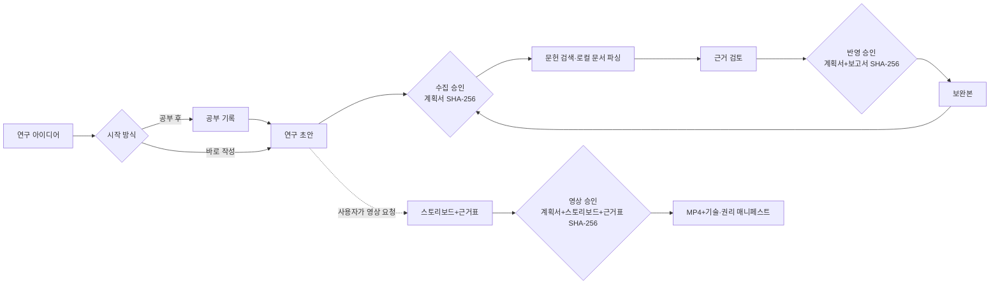

# Research Orchestrator Kit

[](https://github.com/yangyeontae-blip/research-orchestrator-kit/actions/workflows/verify.yml)

연구 아이디어를 공부 기록, APA 7·JQI·범용 연구계획서, 문헌 근거, 보완본과 설명 영상까지 연결하는 **로컬 우선 연구 오케스트레이터**입니다. PDF·HWP·HWPX를 로컬에서 읽고, 승인된 Markdown 계획서에서 DOCX·HWPX를 만듭니다. 파일과 SHA-256을 기준으로 다섯 에이전트가 같은 버전을 읽었는지 확인하고, 문헌 수집·근거 반영·영상 렌더링은 사람이 승인한 정확한 버전에서만 진행합니다.

> 현재 버전: `v0.4.0`
>
> 실행 환경: Node.js 20 또는 22
>
> 외부 평가 상태: 9.5점 목표 후보 — 최소 3인의 비교 평가 전에는 9.5점 달성을 주장하지 않습니다.

## 70초 소개 영상

[](https://yangyeontae-blip.github.io/research-orchestrator-kit/video/player/)

위 미리보기는 README에서 자동 반복 재생됩니다. 클릭하면 한국어 나레이션·자막·배경음이 포함된 원본을 재생합니다.

영상은 실제 연구 결과가 아닌 도구의 합성 사용 흐름을 보여줍니다. 소스·대본·자막은 [`docs/video/v0.3/`](docs/video/v0.3/)에 공개합니다.

## 무엇을 해결하나

- 아이디어만 입력해도 `APA 7`, `JQI`, `generic` 중 목적에 맞는 계획서 흐름을 시작합니다.
- 공부부터 시작하거나 바로 계획서를 작성할 수 있습니다.
- Crossref·OpenAlex의 공개 메타데이터를 검색하고 DOI, 제목, 저자, 연도로 중복을 제거합니다.
- 사용자가 합법적으로 가진 PDF·HWP·HWPX만 로컬에서 파싱하며 스캔 PDF는 `needs_ocr`로 멈춥니다.
- 계획서의 주요 주장마다 문헌과 확인 위치, 검증 상태를 연결합니다.
- 계획서 Markdown을 승인 원본으로 삼아 같은 내용의 DOCX 또는 HWPX를 생성합니다.
- 실패한 단계만 다시 실행하고 이미 확인된 산출물은 보존합니다.
- 계획서가 완성된 뒤 요청하면 연구 흐름 설명 영상의 스토리보드와 렌더링을 별도 승인 관문으로 처리합니다.

이 도구는 연구자의 판단을 대신하지 않습니다. 읽지 않은 문헌을 읽었다고 표시하거나 경험·결과·인용·쪽수를 만들지 않으며, 유료벽·로그인 우회, OCR, HWP 바이너리 생성, 기관 구독 자동 사용을 제공하지 않습니다.

## 다섯 에이전트와 세 승인 관문

| 역할 | 담당 |
|---|---|
| 기획팀장 | 상태, 인계, 승인 관문, 오류 재개 |
| 공부 에이전트 | 학습 지원, 공부 기록, 연구 연결 제안 |
| 연구 에이전트 | 계획서, 근거 검토, 승인 항목 반영 |
| 문헌 에이전트 | 검색, 중복 검사, 합법적 PDF·HWP·HWPX 등록·파싱 |
| 영상 에이전트 | 연구 흐름 스토리보드, 장면별 근거표, 승인된 영상 렌더링 |



계획서와 영상은 산출 직후 `generated`로 표시합니다. 자동 검사 결과가 맞으면 `automated_verified`, 산출물을 실제로 사용해 확인한 근거까지 기록해야 `use_verified`가 됩니다. 계획서는 마지막 상태가 되기 전까지 수집 승인 관문으로 넘어가지 않으며, 영상도 재생·탐색·소리 확인 전에는 완료로 표시하지 않습니다.

영상 가지는 연구계획서 흐름을 막지 않습니다. 계획서가 바뀌면 그 계획서에 묶인 수집 승인과 영상 승인이 자동으로 무효화됩니다.

## 10분 Quick Start

### 1. 설치

```bash
git clone https://github.com/yangyeontae-blip/research-orchestrator-kit.git
cd research-orchestrator-kit
npm ci
npm link
rok --help
```

전역 링크가 싫다면 모든 `rok` 명령을 `node src/cli.mjs`로 바꿔 실행할 수 있습니다.

### 2. 연구 시작

```bash
rok new
```

마법사가 다음 항목을 한 번씩 묻고 `workspace/<프로젝트>/research-brief.json`과 첫 작업을 만듭니다.

- 연구 아이디어와 제목
- `apa7`, `jqi`, `generic`
- `study_then_plan` 또는 `direct_plan`
- 연구방법, 마감일, 제출기관 지침
- 민감정보 포함 가능성
- APA 7 선택 시 학생 원고 또는 전문 원고

자동화 테스트나 반복 실행에서는 합성 답변 파일을 사용할 수 있습니다.

```bash
rok new --answers examples/my-synthetic-answers.json
```

### 3. 다음 작업과 상태 확인

```bash
rok next
rok status
```

`next`는 다음 대기 작업 하나를 해당 역할 어댑터에 전달합니다. `status`는 터미널에서 현재 단계, 승인 대기, 실패, 영상 가지와 다음 행동을 사람이 읽기 쉽게 보여줍니다. 기계가 읽는 JSON은 `rok status --json`으로 받습니다.

예약·heartbeat는 없습니다. 사용자가 명령할 때만 움직입니다.

계획서나 영상 작업의 receipt를 제출한 뒤에는 `rok status`에 검증 대기가 표시됩니다. 먼저 `rok validate` 등 자동검사를 마친 다음 실제 사용 확인 결과를 JSON으로 기록해 `rok verify-use <task-id> <verification.json>`을 실행합니다. 확인하지 못한 항목은 통과로 적지 않습니다. 입력 형식과 산출물별 확인 방법은 [실사용 검증 안내](docs/USE-VERIFICATION.md)에 있습니다.

### 4. 문헌 검색과 사용자 문서 등록

```bash
rok literature search --query "teacher identity qualitative interview"
rok literature ingest "C:\path\to\legally-owned-paper.pdf" --id lit-123456789abc
rok literature ingest "C:\path\to\legally-owned-paper.hwpx"
```

검색식·검색일·출처·선정 또는 제외 이유는 `literature-manifest.json`에 남습니다. PDF는 업로드하지 않고 로컬에서 PDF.js로 페이지별 텍스트를 만듭니다. 사용 권한이 있는 HWP/HWPX는 로컬 [Kordoc](https://github.com/chrisryugj/kordoc)으로 텍스트를 추출합니다.

- 실제 PDF 서명 확인
- SHA-256 기록
- 메타데이터와 대상 문헌의 일치 여부 확인
- 텍스트가 거의 없으면 `needs_ocr`
- 인쇄 쪽수를 사람이 확인하지 않으면 `PDF n쪽`
- 중단 뒤 이미 파싱한 페이지부터 재개
- HWP/HWPX는 파일 해시·Kordoc 버전·추출 경로를 기록하고, 사람이 대조하기 전 인쇄 쪽수는 만들지 않음

### 5. 근거와 계획서 검사

`claim-ledger.json`의 검증 상태는 네 값만 사용합니다.

| 값 | 화면 표시 | 의미 |
|---|---|---|
| `original_verified` | 원문 확인 | 사람이 원문과 위치를 대조함 |
| `parsed_verified` | 파싱 확인 | 추출본에서 확인했으나 원문 대조가 남음 |
| `metadata_only` | 초록·메타데이터만 확인 | 본문을 읽었다고 볼 수 없음 |
| `unverified` | 미확인 | 검증 전 주장 |

```bash
rok validate
```

이 명령은 연구질문–자료–분석 표지, 근거 상태, 실행 가능성, 윤리, 인용–참고문헌 대응, 프로필 형식을 확인해 `quality-report.json/.md`를 만듭니다. 자동 검사, AI 평가, 사람 평가는 서로 다른 필드입니다. 자동 점수는 학술적 타당성이나 게재 가능성을 뜻하지 않습니다.

### 6. DOCX 또는 HWPX 내보내기

```bash
rok export
rok export --format hwpx
```

Markdown이 승인 대상 원본입니다. DOCX/HWPX와 품질 보고서의 해시는 `document-manifest.json`에 기록됩니다. Markdown이 바뀌면 기존 파생 문서 매니페스트와 승인이 유효하지 않으며 다시 생성해야 합니다. HWPX는 Kordoc으로 생성한 뒤 로컬 재파싱하지만, 별도 렌더링 전에는 시각 검증 완료로 표시하지 않습니다.

- APA 7: 학생/전문 원고 선택과 제출기관 지침을 우선
- JQI: 공개 최신 규정과 사용자가 별도로 받은 양식을 우선
- HWP 바이너리와 PDF 생성은 제공하지 않음

### 7. 연구 흐름 영상 요청

계획서가 준비된 뒤에만 실행합니다.

```bash
rok video request --audience "대학원 연구자" --duration 180 --aspect 16:9
rok next
```

영상 에이전트는 문제 → 목적 → 연구질문 → 이론/개념 → 자료 → 분석 → 윤리 → 예상 기여와 한계를 장면으로 설계합니다. `video_storyboard`와 `video_source_map`을 만든 뒤 영상 승인 관문에서 멈춥니다. 승인 JSON은 현재 계획서·스토리보드·근거표의 정확한 해시를 포함해야 합니다.

```bash
rok approve video workspace/video-approval.json
rok next
```

렌더링 결과는 MP4와 `video-manifest.json`을 포함해야 합니다. 배포 URL에서 직접 재생·탐색·소리를 확인한 뒤에만 `use_verified`로 올립니다. 매니페스트에는 전체 디코딩, 해상도, 자막, 오디오, 출처·라이선스 점검을 기록합니다. 영상은 계획의 예상 기여를 완료된 연구 결과처럼 말할 수 없습니다.

## 에이전트 연결

`config.example.json`을 `config.local.json`으로 복사하고 역할별 provider를 정합니다. 실제 채팅 ID와 API 모델은 로컬 파일에만 둡니다.

```json
{
  "schema_version": 1,
  "agents": {
    "orchestrator": { "provider": "manual" },
    "study": { "provider": "codex", "target": "replace-with-thread-id" },
    "research": { "provider": "claude", "inbox": ".research-work/claude/research" },
    "literature": { "provider": "manual" },
    "video": { "provider": "manual" }
  }
}
```

지원 provider:

- `manual`: 메시지와 receipt를 사람이 옮김
- `codex`: 대상 채팅과 완결된 인계 메시지를 생성
- `claude`: 같은 요청 JSON을 로컬 inbox에 저장
- `openai_api`: OpenAI Responses API
- `anthropic_api`: Anthropic Messages API

API 키는 환경변수만 사용합니다. API 호출 때마다 제공자·모델·전송 파일·크기·해시·민감정보 탐지 결과를 보여주며 사용자가 `SEND`를 입력해야 합니다. PDF·DOCX·HWP·HWPX는 전송할 수 없습니다. 자세한 내용은 [클라우드 개인정보 보호](docs/CLOUD-PRIVACY.md)를 보십시오.

## 저수준 CLI 호환성

v0.1 자동화는 그대로 읽을 수 있습니다.

```bash
rok init --profile generic
rok enqueue workspace/request.json
rok claim <task-id> --agent <name>
rok complete workspace/receipt.json
rok approve collection workspace/approval.json
rok approve revision workspace/approval.json
rok status --json
rok retry <task-id>
```

상태 스키마는 계속 1이며 v0.2 정보는 선택 필드와 별도 산출물로 추가됩니다.

## 프로필과 권리 범위

| 프로필 | 용도 | 관문 |
|---|---|---|
| `generic` | 학술지 중립 계획서 | 사람 승인과 공통 정합성 검사 |
| `apa7` | APA Style 7판 과제·계획서 | 제출기관 지침, 학생/전문 원고, hard checks |
| `jqi` | 한국질적탐구학회 투고 형식 호환 | 도구 자체의 9.0 초과·루브릭 8점·hard checks |

APA Style은 하나의 보편적 연구계획서 목차를 정하지 않으므로 계획서 장 구성은 이 도구의 제안입니다. APA 매뉴얼·견본 논문·로고를 포함하지 않습니다. JQI 프로필은 [공식 투고규정](https://www.kaqi.or.kr/subList/32000001464)을 2026-10-09에 확인해 사실 요건을 독립적으로 요약했으며 학회 HWP/DOC·로고·원고를 포함하지 않습니다. 두 기관과 제휴하거나 승인을 받은 도구가 아닙니다.

## 표준 로컬 산출물

```text
workspace/<project>/
├─ research-brief.json
├─ literature-manifest.json
├─ claim-ledger.json
├─ quality-report.json / quality-report.md
├─ plan.md / plan.docx / plan.hwpx
├─ document-manifest.json
├─ parsed/<document-sha256>/pages.json 또는 document.json / text.md
└─ video/ (요청한 경우)
```

`workspace/`, `.research-work/`, 다운로드 문헌, 생성 DOCX와 MP4는 기본적으로 Git에서 제외됩니다. 이 저장소의 소개 영상만 문서 자산으로 명시적으로 추적합니다.

## 검증

```bash
npm run verify
```

검증은 다음을 한 번에 실행합니다.

- 상태 전환, 해시 승인, 실패 재개, 영상 가지 관문
- Crossref/OpenAlex 중복·429 재시도
- 잘못된 PDF, 스캔 PDF, HWP/HWPX, 서지 불일치, 페이지 추적·재개
- 근거 상태, 인용–참고문헌, 변경된 Markdown과 매니페스트 불일치
- OpenAI·Anthropic mock 호출과 매 호출 확인
- DOCX ZIP/XML 구조와 Markdown 핵심 순서, HWPX 생성·재파싱
- 합성 APA 7 자문화기술지, JQI 면담, 범용 양적 사례
- npm 패키지 허용목록과 전체 Git 이력 개인정보 감사

GitHub Actions는 Ubuntu·Windows, Node.js 20·22에서 `npm ci` 후 같은 검증을 실행합니다. 실제 API smoke test는 기본 CI에서 실행하지 않습니다.

## 9.5점 목표의 의미

자동 검사만으로 9.5점을 선언하지 않습니다. [외부 사용자 평가 절차](docs/EXTERNAL-EVALUATION.md)에 따라 대학원 연구자 또는 방법 검토자 최소 3명이 v0.1과 v0.2를 비교하고, 전체 평균 9.5 이상이면서 사용성·근거 추적성·방법 정합성·안전성·문서 완성도 어느 항목도 9.0 미만이 아닐 때만 공개 문구를 바꿉니다.

## 보안·개인정보·저작권

- 실제 계획서, 학습 기록, 논문 PDF, HWP·DOCX, 파싱 본문, 채팅 ID, 절대 경로는 공개하지 않습니다.
- 다운로드 권한과 구독을 우회하지 않습니다.
- 검색 결과를 읽은 문헌으로 표시하지 않습니다.
- 외부 이미지·음악·폰트는 이용 조건을 확인해 영상 자산 매니페스트에 기록합니다.
- MIT 라이선스는 이 프로젝트의 코드와 자체 문서에만 적용됩니다.

자세한 내용은 [개인정보·저작권](docs/PRIVACY-COPYRIGHT.md), [보안 정책](SECURITY.md), [제3자 고지](THIRD_PARTY_NOTICES.md)를 보십시오.

## 문서

- [CLI 참조](docs/CLI-REFERENCE.md)
- [아키텍처](docs/ARCHITECTURE.md)
- [검증 범위](docs/EVALUATION.md)
- [클라우드 개인정보 보호](docs/CLOUD-PRIVACY.md)
- [외부 사용자 평가](docs/EXTERNAL-EVALUATION.md)
- [영문 Quick Start](README.en.md)

## 라이선스

MIT. 제3자 학술 양식, 논문, 로고, 음악과 이미지의 권리는 각 권리자에게 있습니다.

