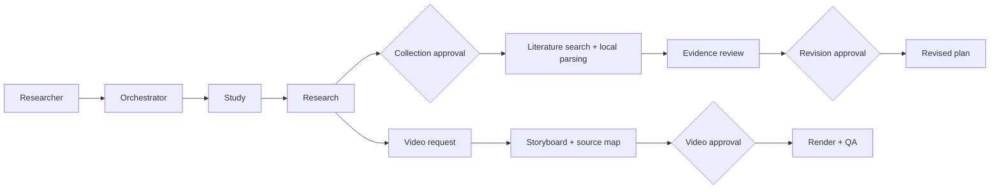

# Architecture

The kit uses files and SHA-256 digests as the handoff boundary. Runtime state stays under `.research-work/`; personal inputs, downloads, parsed text, and generated documents are ignored by Git.

The main state schema remains version 1. New v0.2 data is optional or stored in standard artifacts so v0.1 workspaces can still be read. Only the orchestrator advances stages. A local exclusive lock protects state mutation, and one role cannot hold two running tasks.

Collection approval binds the current Markdown plan hash. Revision approval binds that plan, the evidence-review report, and selected item IDs. Video approval binds the plan, storyboard, and source map. A changed source invalidates its approval. Video is an optional branch and does not block the research workflow.

Crossref and OpenAlex supply metadata only. PDF.js parses local PDFs and Kordoc parses local HWP/HWPX files the user lawfully holds. Evidence states are limited to original verified, parsed verified, abstract/metadata only, and unverified. Automated checks, AI assessment, and human judgment remain separate in the quality report.

The canonical plan is Markdown. DOCX/HWPX and their manifest bindings are derived from the same source. HWPX additionally receives a local Kordoc round-trip parse, which is not visual-layout verification. Cloud adapters accept only allowlisted text files, require per-call human confirmation, and never upload source office documents.

Every role handoff records the goal, existing user decisions, input file/version/hash, unresolved items, next action, and completion criteria. A receipt proves only what its artifacts and checks show. Reporting distinguishes artifact creation, automated verification, and end-user verification. Research plans need a source and methods review; exported documents need opening and visual inspection; published videos need play, seek, and sound checks at their public URL. Missing checks remain explicitly unverified.

Video and HWPX export run on request and do not change the main research sequence. Release operations follow [`RELEASE-OPERATIONS.md`](RELEASE-OPERATIONS.md).
